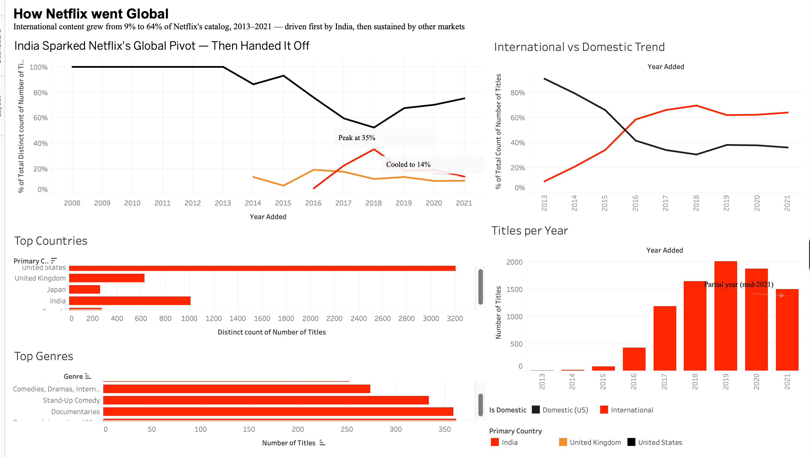

# Netflix Content Strategy Analysis

## Overview

This project analyzes 8,807 Netflix titles using Python and Tableau to explore how Netflix's content catalog has evolved over time. The analysis focuses on content type balance, geographic distribution, catalog growth, and genre trends to uncover insights into Netflix's global content strategy.

## Objectives

This analysis aims to answer the following questions:

- What type of content dominates Netflix's catalog, and how has this changed over time?
- Which countries contribute the most Netflix content?
- How has Netflix's content volume evolved over time?
- What genres are most prevalent in the catalog?

## Dataset

Source: Netflix Movies and TV Shows dataset (Kaggle)

The dataset contains 8,807 Netflix titles with information including:

- Title
- Content type (Movie or TV Show)
- Country
- Date added
- Release year
- Rating
- Duration
- Genres

## Tools Used

- Python (Pandas, NumPy, Matplotlib)
- Jupyter Notebook
- Tableau
- Git/GitHub

## Data Processing

The dataset was cleaned and prepared for analysis through the following steps:

- Converted `date_added` into datetime format and extracted year information
- Derived primary country from multi-country entries
- Filled missing categorical values with "Unknown"
- Removed 17 records with missing critical fields, representing less than 0.2% of the dataset
- Split multi-genre values from the `listed_in` column to enable genre-level analysis

## Key Insights

### 1. Movies dominate Netflix's catalog, but TV Shows are growing

Movies represent approximately 69.7% of Netflix's catalog. However, their share declined from around 75% in 2018 to approximately 66% in 2021, indicating a gradual shift toward increasing TV Show content.

### 2. The United States and India lead content production

The United States contributes the largest number of titles (3,202), followed by India (1,008) and the United Kingdom (627), highlighting the importance of these markets in Netflix's global catalog.

### 3. Netflix experienced significant catalog growth after 2016

Content additions increased rapidly after 2016, reaching a peak of 2,016 titles added in 2019. The lower volume observed in 2021 is likely influenced by incomplete-year data collection.

### 4. Global content contribution increased significantly

Content from international markets grew substantially, increasing from approximately 9% of additions in 2013 to over 60% from 2016 onward. This highlights Netflix's expansion toward a more globally diverse catalog.

### 5. International Movies and Dramas are the most common genres

"International Movies" (2,752 titles) and "Dramas" (2,426 titles) are the most frequent genres in Netflix's catalog, reflecting the platform's focus on diverse international storytelling.

## Dashboard

Interactive Tableau Dashboard:

[https://public.tableau.com/app/profile/hazeezat.adebimpe.adebayo/viz/Book1_17836937265950/NetflixContentStrategyAnalysis#1]

## Analysis Notebook

The complete Python analysis and data exploration can be found here:

[Netflix Analysis Notebook](notebooks/Netflix_Analysis.ipynb)

## Repository Structure
## Limitations

- Approximately 9% of titles have missing country information
- 2021 data represents a partial-year collection period
- The dataset represents a historical snapshot and does not reflect real-time Netflix catalog updates
- No viewership or engagement metrics are included; therefore, analysis reflects content availability rather than performance

## Key Takeaway

Netflix's content catalog has shifted toward greater international expansion and increased TV Show production while maintaining a strong movie foundation. Growth after 2016 was driven largely by global content diversification, demonstrating Netflix's transition from a primarily US-focused platform into a global streaming service.
